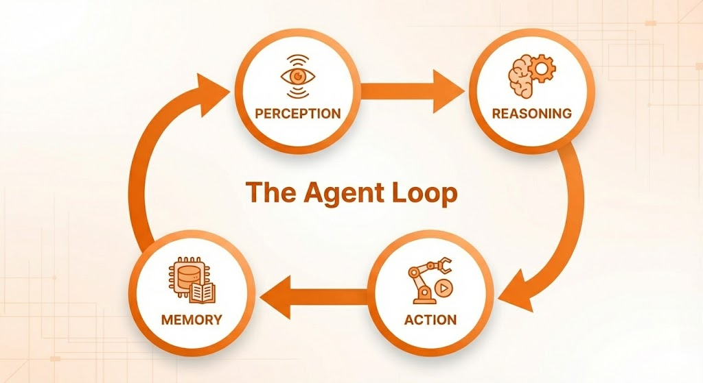

# 1.1 The Agent Loop 🔄

## The Brain of the Operation

An AI Agent is not just a chatbot. It's a system that follows a loop:
1.  **Perception**: It receives input (user query, tool output).
2.  **Reasoning**: It thinks about what to do next (using an LLM).
3.  **Action**: It executes a command (calls a function, searches the web).
4.  **Memory**: It remembers the result of that action.



This cycle repeats until the task is done.

## The "Reflective" Agent

The simplest form of agentic behavior is **Reflection**. The agent generates an answer, critiques it, and then improves it.

### Hands-On: Building a Simple Agent

We will build a simple Python script that simulates a conversation where the agent "thinks" before it speaks.

**File:** `simple_agent.py` (See the `code/` folder)

```python
import os
from dotenv import load_dotenv
from langchain_openai import ChatOpenAI
from langchain_core.messages import HumanMessage, SystemMessage

load_dotenv()

llm = ChatOpenAI(model="gpt-4o", temperature=0.7)

def simple_agent(query):
    print(f"User: {query}")
    print("Agent: Thinking...")
    
    # Step 1: Reasoning (The Plan)
    messages = [
        SystemMessage(content="You are a helpful assistant. Before answering, explain your thought process."),
        HumanMessage(content=query)
    ]
    
    response = llm.invoke(messages)
    
    print(f"Agent Response:\n{response.content}")

if __name__ == "__main__":
    simple_agent("What is the capital of France?")
```

### Key Takeaway
Notice how the "System Message" guides the agent's behavior. This is the seed of **Agentic Reasoning**.
