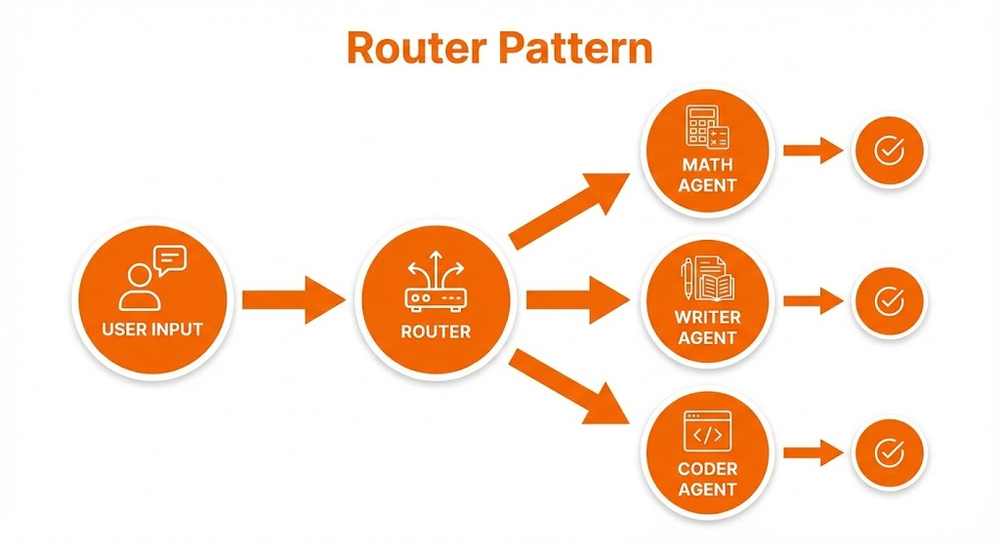

# 3.3 Multi-Agent Systems (MAS) 🤝

A single agent can do a lot, but a **Team of Agents** can do anything.

## The Specialist Principle
Instead of one generalist agent trying to do math, writing, and coding, we create specialized agents:
*   **Math Agent**: Expert in calculation.
*   **Writer Agent**: Expert in prose.
*   **Coder Agent**: Expert in Python.

## The Router (Orchestrator)
To manage these specialists, we need a **Router**. The Router looks at the user's request and decides *who* should handle it.

## Hands-On: A Simple Router
In `router_agent.py`, we will build a system where a "Supervisor" routes tasks to either a "Math Expert" or a "History Expert".
