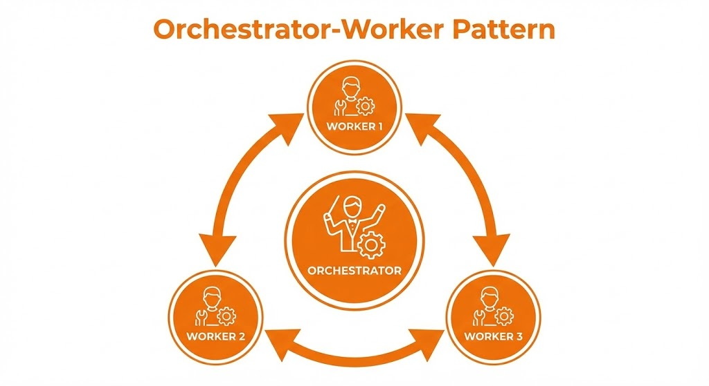

# 4.1 Coordination Patterns 🤝

When you have multiple agents, how do they talk to each other?

## 1. Orchestrator-Workers (The Boss and the Team)
*   **Orchestrator**: Breaks down the plan and assigns tasks.
*   **Workers**: Execute tasks and report back.
*   **Pros**: Easy to manage, clear hierarchy.
*   **Cons**: The boss can become a bottleneck.

## 2. Peer-to-Peer (The Roundtable)
*   Agents talk directly to each other.
*   Example: A "Developer" agent sends code to a "Tester" agent. The "Tester" sends bugs back to the "Developer".
*   **Pros**: Flexible, decentralized.
*   **Cons**: Harder to debug (infinite loops!).

## Hands-On: The Research Team
In `research_team.py`, we will build an **Orchestrator-Worker** system.
*   **User**: "Research the future of AI."
*   **Orchestrator**: "Researcher, find facts. Writer, write a summary."
