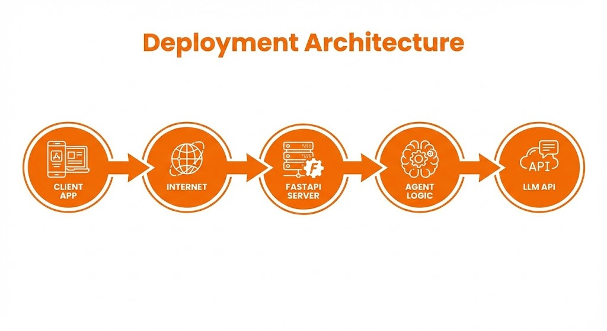

# 5.3 Deployment with FastAPI 🚀

Your agent is useless if it only lives in your terminal. We need to wrap it in an API so a frontend (React, Mobile App) can talk to it.

## Why FastAPI?
*   **Fast**: High performance.
*   **Async**: Handles multiple requests at once (crucial for slow LLM calls).
*   **Auto-Docs**: Generates Swagger UI automatically.

## The Architecture
1.  **Client** sends POST request to `/chat`.
2.  **Server** receives request.
3.  **Agent** processes it (this can take 5-10 seconds).
4.  **Server** returns JSON response.



## Hands-On: Building the API
In `api_server.py`, we will wrap our `simple_agent` from Module 1 in a FastAPI server.

### Prerequisites
```bash
pip install fastapi uvicorn
```

### Running the Server
```bash
python api_server.py
```
Then go to `http://localhost:8000/docs` to test it!
